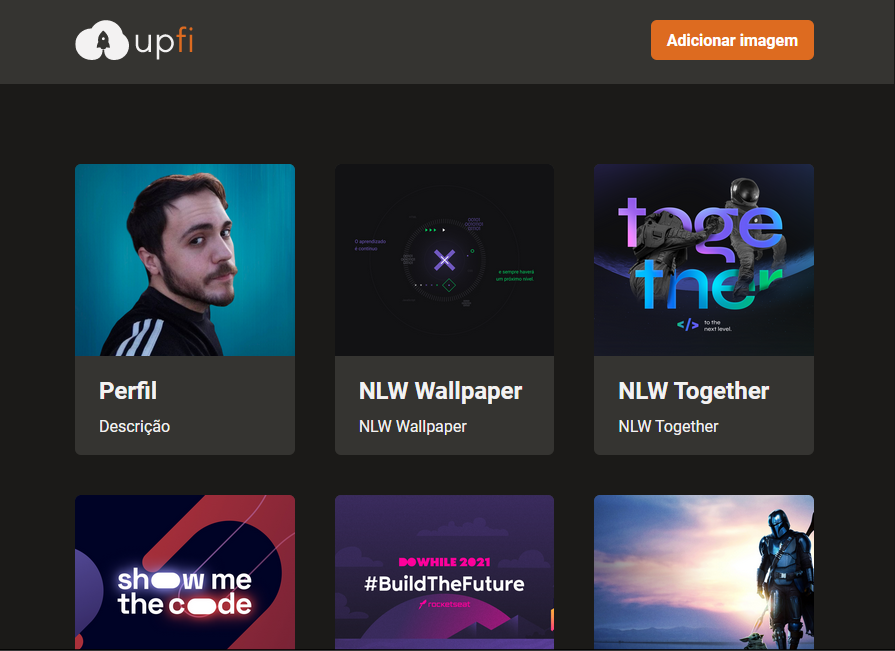

# Upfi

Demo: https://capelaum-upfi.vercel.app

## Ignite React.js - Módulo 4, Desafio 2

Aplicação de upload de imagens no [ImgBB][img_bb], utilizando diversas ferramentas como React Query, React Hook Form e FaunaDB, utilizando ainda Chakra UI para a interface.

## Descrição

[Descrição do desafio][description]

## Layout

Pode-se ver o [layout][figma] no figma.

## Tech

- [React Query][react_query]
- [React Hook Form][react_hook_form]
- [Fauna DB][fauna_db]
- [Chakra UI][chakra_ui]
- [React Icons][react_icons]
- [Axios][axios]
- [Framer Motion][framer_motion]

[react_query]: https://react-query.tanstack.com
[react_hook_form]: https://react-hook-form.com
[fauna_db]: https://fauna.com
[chakra_ui]: https://chakra-ui.com
[axios]: https://github.com/axios/axios
[img_bb]: https://pt-br.imgbb.com
[react_icons]: https://react-icons.github.io/react-icons
[framer_motion]: https://www.framer.com/motion

[figma]: https://www.figma.com/file/FBNQKO523802V4MHcJia5y/Desafio-2-M%C3%B3dulo-4-ReactJS-Copyfuid=825800961521335351]
[description]: https://www.notion.so/Desafio-02-Upload-de-imagens-4cf1c3b1c1ad4a66961b6e48558cc3b8

## Créditos

🚀 [Rocketseat](https://www.rocketseat.com.br/)
